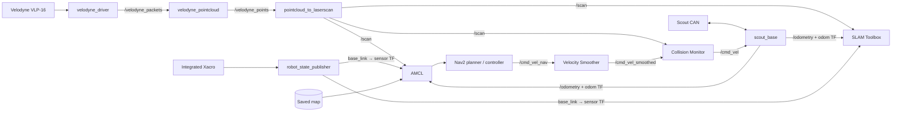

# Scout–UR3e Mobile Manipulator ROS 2 Workspace

AgileX Scout 2.0 모바일 베이스에 **UR3e**, **Robotiq 2F-85**, **Velodyne VLP-16**,
**Intel RealSense D435i**를 통합한 ROS 2 Humble 워크스페이스입니다.

실기 로봇 bringup부터 2D SLAM, 맵 저장, AMCL localization, Nav2 자율주행까지
하나의 워크스페이스에서 실행할 수 있습니다. 현재 자율주행의 기본 진입점은
`scout_bringup` 패키지입니다.

> UR3e 실제 제어와 MoveIt, 그리퍼, GNSS/LiDAR SLAM 패키지도 포함되어 있지만
> 기본 SLAM/Nav2 launch에서는 자동으로 실행하지 않습니다.

## Warehouse Simulation

> **Gazebo 창고 시뮬레이션을 사용하려면 아래 문서를 먼저 확인하세요.**
>
> ### [▶ Scout 창고 SLAM·Nav2 시뮬레이션 전체 사용 설명서](./sim.md)
>
> 시뮬레이션 실행, 키보드 주행, SLAM, 맵 저장, Nav2, UR3e 제어 및 카메라 확인
> 명령어가 정리되어 있습니다.

## Robot Model

<p align="center">
  
  
</p>

통합 Xacro는 Scout, UR3e, Robotiq 2F-85, D435i 및 VLP-16의 링크와 고정 TF를
정의합니다.

```bash
ros2 launch scout_ur3e_description display.launch.py
```

## Demo

### 1. SLAM 시작 및 Mapping

```bash
ros2 launch scout_bringup system.launch.py mode:=mapping
```

<p align="center">
  
</p>

### 2. Map 저장

```bash
ros2 run nav2_map_server map_saver_cli \
  -f "$ROS2_WS/src/scout_bringup/maps/scout_map"
```

<p align="center">
  
</p>

### 3. AMCL 초기 위치 추정

Nav2를 실행한 뒤 로봇의 실제 시작 위치가 맵 원점과 다르면 RViz의
`2D Pose Estimate`로 위치와 방향을 지정합니다.

<p align="center">
  
</p>

### 4. Nav2 자율주행

RViz의 `Nav2 Goal`로 목적지를 지정합니다.

<p align="center">
  
</p>

## System Architecture



SLAM과 localization에서의 TF 소유 관계는 다음과 같습니다.

| TF | Mapping | Navigation |
|---|---|---|
| `map → odom` | SLAM Toolbox | AMCL |
| `odom → base_link` | `scout_base` | `scout_base` |
| `base_link → velodyne_link` | `robot_state_publisher` | `robot_state_publisher` |

SLAM Toolbox와 AMCL을 동시에 실행하면 두 노드가 모두 `map → odom`을 발행하므로
mapping launch를 완전히 종료한 뒤 navigation을 실행해야 합니다.

## Package Overview

### Main packages

| 경로 | 역할 |
|---|---|
| `src/scout_bringup` | 실기 센서/베이스 bringup, SLAM, map server, AMCL, Nav2 통합 launch 및 파라미터 |
| `src/scout_warehouse_sim` | Scout + 접힌 UR3e + VLP-16, A–D 작업대/집기 물체가 있는 창고 SLAM·Nav2 시뮬레이션 |
| `src/scout_ur3e_description` | Scout + UR3e + Robotiq + D435i + VLP-16 통합 URDF/Xacro |
| `src/scout_nav2/scout_nav2` | Scout용 Nav2 파라미터, RViz 설정, 맵 |
| `src/scout_nav2/nav2_bringup` | Collision Monitor를 포함하도록 수정된 Nav2 bringup (`nav2_bringup_custom`) |
| `src/direct_pose` | 지정한 pose로 이동 명령을 발행하는 Python 노드 |
| `src/trajectory_player` | UR 로봇용 joint trajectory 재생 노드 |

### Hardware and drivers

| 경로 | 역할 |
|---|---|
| `src/scout_ros2`, `src/ugv_sdk` | Scout 베이스 CAN 제어, 메시지, 모델 및 하위 SDK |
| `src/velodyne` | VLP-16 패킷 수신, PointCloud2 변환, LaserScan 관련 패키지 |
| `src/realsense-ros` | Intel RealSense 카메라 드라이버, 메시지, description |
| `src/Universal_Robots_ROS2_Driver`, `src/ur_client_library` | UR3e 실기 드라이버, 컨트롤러, MoveIt 연동 |
| `src/ur_robotiq` | UR 로봇과 Robotiq 그리퍼의 결합 description |
| `src/dh_ag95_gripper_ros2-humble` | DH Robotics AG95 그리퍼 description 및 드라이버 |

### Localization, mapping, and positioning

| 경로 | 역할 |
|---|---|
| `src/lidarslam_ros2`, `src/ndt_omp_ros2` | NDT/GICP scan matching 기반 3D LiDAR SLAM 실험 패키지 |
| `src/ublox`, `src/ntrip_client` | u-blox GNSS 및 NTRIP/RTCM 보정 데이터 처리 |
| `src/um7`, `src/serial-ros2` | UM7 IMU 및 serial 통신 |
| `src/g2o`, `src/osqp`, `src/ament_cmake` | 일부 패키지가 사용하는 외부 라이브러리와 빌드 도구 |

`scout_nav2` 아래의 `agilex_scout`와 `aws-robomaker-small-warehouse-world`는
Gazebo 시뮬레이션용 모델과 월드입니다. 각 외부 패키지의 상세 사용법과 라이선스는
해당 디렉터리의 README 및 LICENSE를 참고하세요.

## Requirements

- Ubuntu 22.04
- ROS 2 Humble
- colcon 및 rosdep
- Scout 2.0 + CAN adapter (`500000` bit/s)
- Velodyne VLP-16 (기본 IP: `192.168.1.201`)
- mapping 시 사용할 키보드 또는 별도 teleop 장치

ROS 환경과 워크스페이스 경로를 설정합니다.

```bash
source /opt/ros/humble/setup.bash
export ROS2_WS="$HOME/ros2_ws"
cd "$ROS2_WS"
```

## Installation

```bash
cd "$ROS2_WS"
rosdep update
rosdep install --from-paths src --ignore-src -r -y
colcon build --symlink-install
source install/setup.bash
```

새 터미널을 열 때마다 ROS와 워크스페이스를 source해야 합니다.

```bash
source /opt/ros/humble/setup.bash
source "$ROS2_WS/install/setup.bash"
```

## Hardware Check

Scout 전원을 켜고 비상정지가 해제된 상태에서 CAN 인터페이스를 확인합니다.

```bash
ip -details link show can0
```

`can0`가 내려가 있다면 다음과 같이 활성화합니다.

```bash
sudo ip link set can0 down
sudo ip link set can0 type can bitrate 500000
sudo ip link set can0 up
candump can0
```

VLP-16과의 네트워크 연결도 확인합니다.

```bash
ping 192.168.1.201
```

다른 CAN 인터페이스나 LiDAR IP를 사용한다면 launch에
`can_interface:=can1`, `lidar_ip:=<IP>`를 전달할 수 있습니다.

## Mapping Workflow

### 1. SLAM 실행

```bash
source "$ROS2_WS/install/setup.bash"
ros2 launch scout_bringup system.launch.py mode:=mapping
```

### 2. 데이터 및 TF 확인

다른 터미널에서 아래 항목이 정상 발행되는지 확인합니다.

```bash
source "$ROS2_WS/install/setup.bash"
ros2 topic hz /velodyne_points
ros2 topic hz /scan
ros2 topic hz /odometry
ros2 run tf2_ros tf2_echo odom base_link
ros2 run tf2_ros tf2_echo map odom
```

### 3. 로봇 주행

```bash
source "$ROS2_WS/install/setup.bash"
ros2 run teleop_twist_keyboard teleop_twist_keyboard
```

급격한 회전과 가감속을 피하고, 이미 주행한 구간을 다시 방문해 loop closure가
생기도록 이동합니다.

### 4. 맵 저장

```bash
mkdir -p "$ROS2_WS/src/scout_bringup/maps"
ros2 run nav2_map_server map_saver_cli \
  -f "$ROS2_WS/src/scout_bringup/maps/scout_map"
```

`scout_map.pgm`과 `scout_map.yaml`이 생성됩니다. 같은 이름의 기존 맵은
덮어쓰므로 필요한 경우 먼저 백업하세요.

## Localization and Navigation Workflow

먼저 mapping launch를 `Ctrl+C`로 종료합니다.

### Localization만 확인

```bash
ros2 launch scout_bringup localization.launch.py \
  map:="$ROS2_WS/src/scout_bringup/maps/scout_map.yaml"
```

### Nav2 전체 실행

```bash
ros2 launch scout_bringup system.launch.py \
  mode:=navigation \
  map:="$ROS2_WS/src/scout_bringup/maps/scout_map.yaml"
```

RViz에서 다음 순서로 진행합니다.

1. 지도와 `/scan`이 일치하는지 확인합니다.
2. 필요하면 `2D Pose Estimate`로 초기 위치와 방향을 지정합니다.
3. particle cloud가 수렴할 때까지 기다립니다.
4. `Nav2 Goal`로 목적지를 지정합니다.

기본 맵인 `src/scout_bringup/maps/scout_map.yaml`을 사용할 때는 `map` 인자를
생략할 수 있습니다.

## Useful Topics

| Topic | Type | Description |
|---|---|---|
| `/velodyne_packets` | `velodyne_msgs/VelodyneScan` | VLP-16 원시 패킷 |
| `/velodyne_points` | `sensor_msgs/PointCloud2` | 변환된 3D point cloud |
| `/scan` | `sensor_msgs/LaserScan` | SLAM, AMCL, Collision Monitor 입력 |
| `/odometry` | `nav_msgs/Odometry` | Scout wheel odometry |
| `/map` | `nav_msgs/OccupancyGrid` | SLAM 또는 map server의 지도 |
| `/cmd_vel` | `geometry_msgs/Twist` | Scout 베이스로 전달되는 최종 속도 명령 |

## Troubleshooting

- RViz에서 `/scan`이 버려지고 지도가 생성되지 않으면 먼저 `can0`, `/odometry`,
  `odom → base_link` TF를 확인하세요.
- 지도와 scan이 어긋나면 LiDAR 고정 TF, wheel odometry, AMCL 초기 pose를
  순서대로 확인하세요.
- Nav2가 활성화되지 않으면 map YAML 내부의 image 경로와 lifecycle node 상태를
  확인하세요.
- 실기 파라미터 설명과 상세 진단 절차는
  [`src/scout_bringup/README.md`](./src/scout_bringup/README.md)와
  [`src/scout_bringup/PARAMETER_TUNING.md`](./src/scout_bringup/PARAMETER_TUNING.md)를
  참고하세요.

## Safety

실기 테스트 전 비상정지 버튼, 주행 공간, CAN 연결을 확인하세요. 첫 Nav2 시험은
낮은 속도에서 진행하고 언제든 로봇을 정지할 수 있는 상태를 유지하세요.

## License

이 워크스페이스에는 서로 다른 라이선스를 사용하는 여러 오픈소스 패키지가
포함되어 있습니다. 재배포 시 각 패키지 디렉터리의 `LICENSE`와 `package.xml`을
확인하세요.
