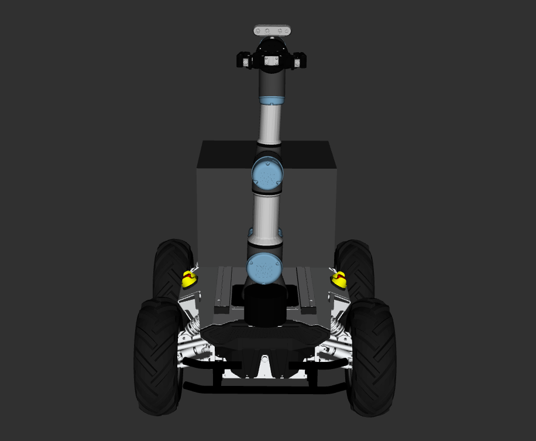
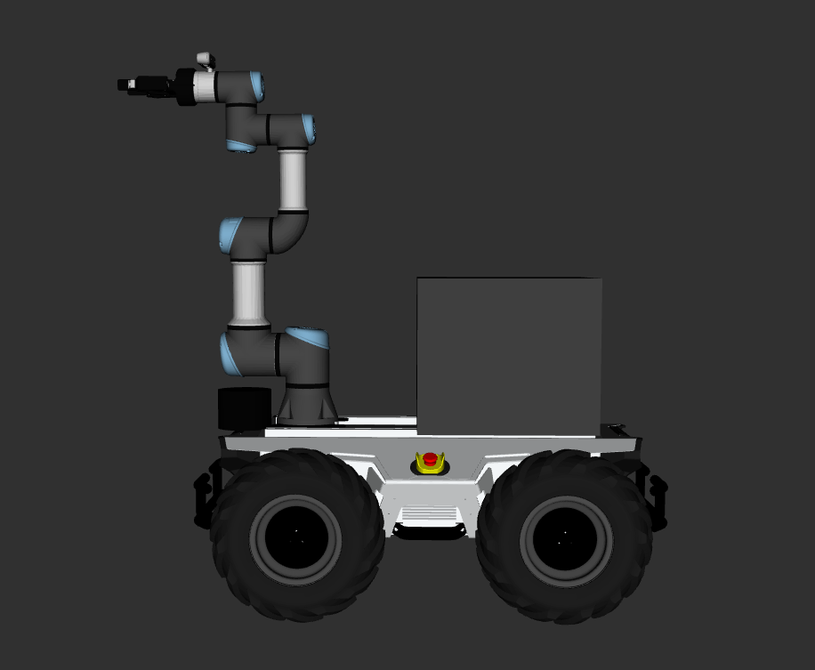
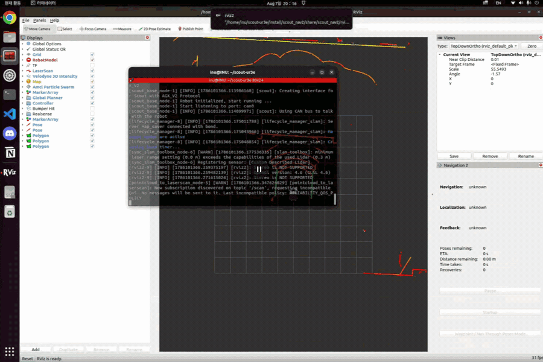
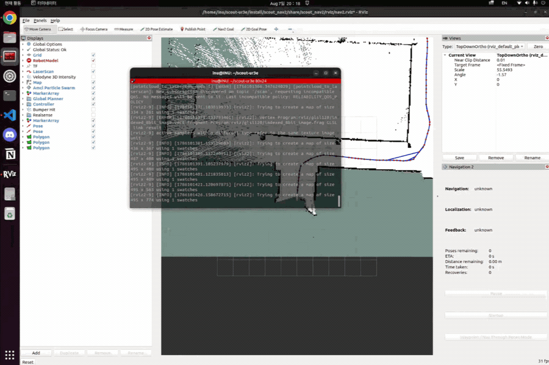
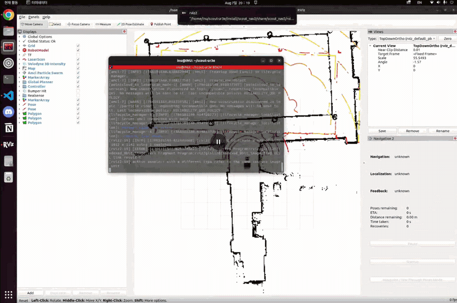
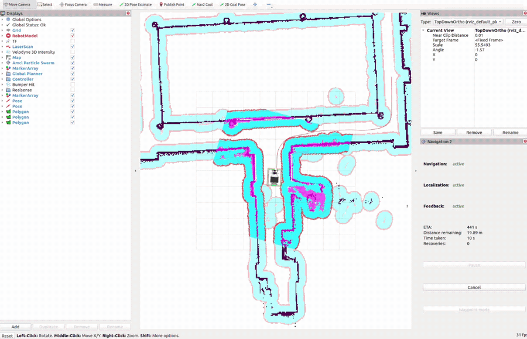
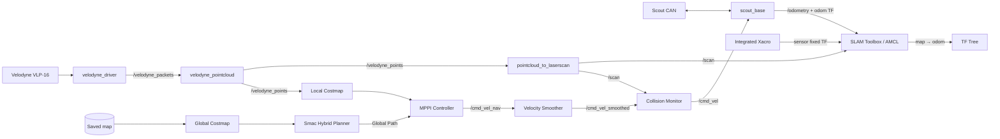

# Scout–UR3e Mobile Manipulator ROS 2 Workspace

AgileX Scout 2.0 모바일 베이스에 **UR3e**, **Robotiq 2F-85**,
**Velodyne VLP-16**, **Intel RealSense D435i**를 통합한 ROS 2 Humble
워크스페이스입니다.

실기 로봇 bringup부터 2D SLAM, 맵 저장, AMCL localization, Nav2 자율주행까지
실행할 수 있습니다. 기본 진입점은 `scout_bringup` 패키지입니다.

> UR3e 실제 제어와 MoveIt, 그리퍼, GNSS/LiDAR SLAM 실험 패키지도 포함되어
> 있지만 기본 SLAM/Nav2 launch에서는 자동 실행하지 않습니다.

## Real Robot Demo

Scout–UR3e 모바일 매니퓰레이터를 실제 하드웨어에서 운용한 모습은 아래 영상에서
확인할 수 있습니다. 이미지를 클릭하면 YouTube로 이동합니다.

<p align="center">
  <a href="https://www.youtube.com/watch?v=2YwVMSP9Xxo">
    
  </a>
</p>

<p align="center">
  <a href="https://www.youtube.com/watch?v=2YwVMSP9Xxo">▶ 실차 운용 영상 YouTube에서 보기</a>
</p>

## Documentation

- [Nav2 학습 자료](./nav2_study/README.md) — 전체 구조, A*, DWB, MPPI
- [창고 시뮬레이션 설명서](./sim.md) — 실행, SLAM, Nav2, UR3e 제어
- [실기 파라미터 튜닝](./src/scout_bringup/PARAMETER_TUNING.md) — 센서와 Nav2 설정 및 진단

## Robot Model

<p align="center">
  
  
</p>

통합 Xacro는 Scout, UR3e, Robotiq 2F-85, D435i와 VLP-16의 링크 및 고정 TF를
정의합니다.

```bash
ros2 launch scout_ur3e_description display.launch.py
```

## Demo

| Mapping | Map 저장 |
|---|---|
|  |  |

| AMCL 초기 위치 추정 | Nav2 자율주행 |
|---|---|
|  |  |

## System Architecture



TF 소유 관계는 다음과 같습니다.

| TF | Mapping | Navigation |
|---|---|---|
| `map → odom` | SLAM Toolbox | AMCL |
| `odom → base_link` | `scout_base` | `scout_base` |
| `base_link → velodyne_link` | `robot_state_publisher` | `robot_state_publisher` |

SLAM Toolbox와 AMCL은 모두 `map → odom`을 발행할 수 있으므로 mapping을 완전히
종료한 뒤 navigation을 실행해야 합니다.

## Quick Start

### Requirements

- Ubuntu 22.04 / ROS 2 Humble
- colcon, rosdep
- Scout 2.0과 CAN adapter (`500000` bit/s)
- Velodyne VLP-16 (기본 IP: `192.168.1.201`)

### 1. Build

저장소를 clone한 실제 경로로 이동한 뒤 `ROS2_WS`를 설정합니다.

```bash
source /opt/ros/humble/setup.bash
cd /path/to/scout_sin_ws
export ROS2_WS="$PWD"

rosdep update
rosdep install --from-paths src --ignore-src -r -y
colcon build --symlink-install
source install/setup.bash
```

새 터미널에서는 다음 환경을 다시 불러옵니다.

```bash
source /opt/ros/humble/setup.bash
source "$ROS2_WS/install/setup.bash"
```

### 2. Hardware 확인

```bash
ip -details link show can0
ping 192.168.1.201
```

`can0`가 내려가 있다면 활성화합니다.

```bash
sudo ip link set can0 down
sudo ip link set can0 type can bitrate 500000
sudo ip link set can0 up
candump can0
```

다른 장치를 사용할 때는 launch에 `can_interface:=can1`,
`lidar_ip:=<IP>`처럼 전달할 수 있습니다.

### 3. Mapping

```bash
ros2 launch scout_bringup system.launch.py mode:=mapping
```

다른 터미널에서 센서와 TF를 확인합니다.

```bash
ros2 topic hz /velodyne_points
ros2 topic hz /scan
ros2 topic hz /odometry
ros2 run tf2_ros tf2_echo odom base_link
ros2 run tf2_ros tf2_echo map odom
```

키보드로 주행하면서 지도를 작성합니다.

```bash
ros2 run teleop_twist_keyboard teleop_twist_keyboard
```

충분히 탐색한 뒤 맵을 저장합니다.

```bash
mkdir -p "$ROS2_WS/src/scout_bringup/maps"
ros2 run nav2_map_server map_saver_cli \
  -f "$ROS2_WS/src/scout_bringup/maps/scout_map"
```

같은 이름의 기존 맵은 덮어쓰므로 필요한 경우 먼저 백업합니다.

### 4. Localization과 Navigation

Mapping launch를 `Ctrl+C`로 완전히 종료한 뒤 실행합니다.

```bash
ros2 launch scout_bringup system.launch.py \
  mode:=navigation \
  map:="$ROS2_WS/src/scout_bringup/maps/scout_map.yaml"
```

기본 맵 `src/scout_bringup/maps/scout_map.yaml`을 사용한다면 `map` 인자를
생략할 수 있습니다.

RViz에서는 다음 순서로 진행합니다.

1. 지도와 `/scan`이 일치하는지 확인합니다.
2. 필요하면 `2D Pose Estimate`로 초기 위치를 지정합니다.
3. particle cloud가 수렴한 뒤 `Nav2 Goal`을 지정합니다.

## Core Packages

| 경로 | 역할 |
|---|---|
| `src/scout_bringup` | 실기 베이스·센서, SLAM, localization, Nav2 통합 launch |
| `src/scout_nav2/scout_nav2` | 실기 Nav2 파라미터, RViz, 맵 |
| `src/scout_nav2/nav2_bringup` | Collision Monitor를 포함한 Nav2 bringup |
| `src/scout_warehouse_sim` | Gazebo 창고 SLAM·Nav2 시뮬레이션 |
| `src/scout_ur3e_description` | Scout + UR3e + 센서 통합 URDF/Xacro |
| `src/scout_ros2`, `src/ugv_sdk` | Scout ROS 2 driver와 CAN SDK |
| `src/velodyne` | VLP-16 driver, PointCloud2 변환 |
| `src/Universal_Robots_ROS2_Driver` | UR3e 실기 driver |

그 밖의 GNSS, IMU, 3D LiDAR SLAM, gripper 및 외부 라이브러리는 `src/` 아래에
포함되어 있습니다. 각 패키지의 상세 내용과 라이선스는 해당 README와
`package.xml`을 확인하세요.

## Useful Topics

| Topic | Type | Description |
|---|---|---|
| `/velodyne_packets` | `velodyne_msgs/msg/VelodyneScan` | VLP-16 원시 패킷 |
| `/velodyne_points` | `sensor_msgs/msg/PointCloud2` | 변환된 3D point cloud |
| `/scan` | `sensor_msgs/msg/LaserScan` | SLAM, AMCL, Collision Monitor 입력 |
| `/odometry` | `nav_msgs/msg/Odometry` | Scout wheel odometry |
| `/map` | `nav_msgs/msg/OccupancyGrid` | SLAM 또는 map server의 지도 |
| `/cmd_vel_nav` | `geometry_msgs/msg/Twist` | Nav2 Controller 출력 |
| `/cmd_vel_smoothed` | `geometry_msgs/msg/Twist` | 속도 제한을 적용한 명령 |
| `/cmd_vel` | `geometry_msgs/msg/Twist` | Scout로 전달되는 최종 명령 |

## Troubleshooting

- `/scan`이 버려지거나 지도가 생성되지 않으면 `can0`, `/odometry`,
  `odom → base_link` TF를 먼저 확인합니다.
- 지도와 scan이 어긋나면 LiDAR 고정 TF, wheel odometry, AMCL 초기 pose를
  순서대로 확인합니다.
- Nav2가 활성화되지 않으면 map YAML의 image 경로와 lifecycle node 상태를
  확인합니다.
- 상세 진단은 [scout_bringup README](./src/scout_bringup/README.md)와
  [파라미터 튜닝 문서](./src/scout_bringup/PARAMETER_TUNING.md)를 참고합니다.

## Safety

실기 테스트 전 비상정지 버튼, 주행 공간과 CAN 연결을 확인합니다. 첫 Nav2 시험은
낮은 속도에서 진행하고 언제든 로봇을 정지할 수 있는 상태를 유지합니다.

## License

이 워크스페이스에는 서로 다른 라이선스의 오픈소스 패키지가 포함되어 있습니다.
재배포 시 각 패키지 디렉터리의 `LICENSE`와 `package.xml`을 확인하세요.
