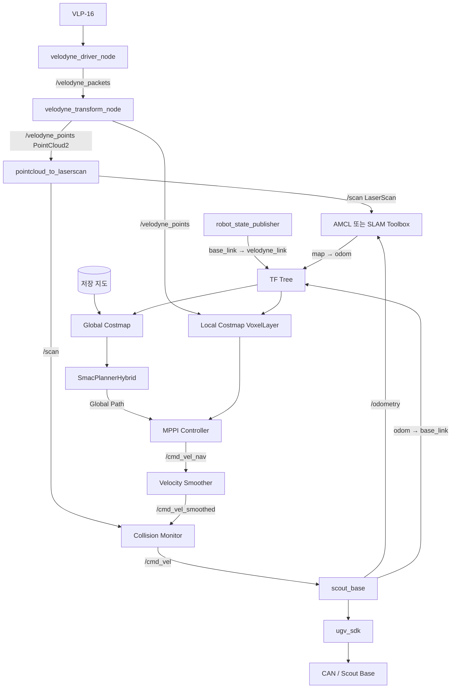
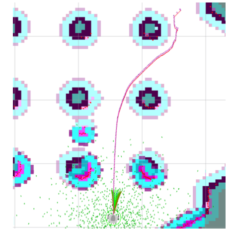
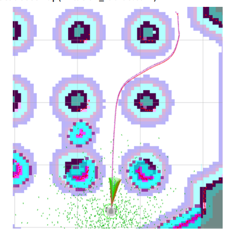

# Scout + Velodyne + Nav2 전체 흐름

[학습 노트 목록으로 돌아가기](README.md)

## 1. 먼저 역할을 나눈다

자율주행을 이해할 때 센서, 위치 추정, 경로 계획, 속도 제어를 한 덩어리로 보면
혼란스럽다.

| 구성 요소 | 답하는 질문 | 대표 출력 |
|---|---|---|
| Velodyne | 주변에 무엇이 얼마나 떨어져 있는가? | `PointCloud2`, `LaserScan` |
| SLAM | 나는 어디에 있고 지도는 어떻게 생겼는가? | `/map`, `map → odom` TF |
| AMCL | 저장된 지도에서 나는 어디에 있는가? | pose, `map → odom` TF |
| Costmap | 이동 공간에서 어느 지점이 위험한가? | 2D cost grid |
| Global Planner | 목적지까지 큰 경로는 무엇인가? | `nav_msgs/Path` |
| Controller | 지금 어떤 속도로 움직일 것인가? | `geometry_msgs/Twist` |
| Scout driver | 속도 명령을 베이스에 어떻게 전달하는가? | SDK/CAN 명령 |

센서는 장애물을 **측정**한다. 회피를 판단하는 것은 센서가 아니라 Costmap에
반영된 장애물 비용을 평가하는 Controller다.

## 2. 실기 기본 구성을 코드에서 확인한 결과

루트 README에서 안내하는 실기 기본 진입점은 다음 명령이다.

```bash
ros2 launch scout_bringup system.launch.py mode:=navigation
```

이 launch는 기본적으로
[`scout_amcl.yaml`](../../src/scout_nav2/scout_nav2/params/scout_amcl.yaml)을
사용한다.

| 영역 | 실제 설정 |
|---|---|
| LiDAR | Velodyne VLP-16 |
| Point cloud | `/velodyne_points` (`sensor_msgs/msg/PointCloud2`) |
| 2D scan | `/scan` (`sensor_msgs/msg/LaserScan`) |
| Mapping | SLAM Toolbox |
| Localization | AMCL |
| Odometry | `scout_base`의 `/odometry`와 `odom → base_link` |
| Global Planner | `nav2_smac_planner/SmacPlannerHybrid` |
| Search model | `REEDS_SHEPP`, Hybrid-A* 계열 |
| Local Controller | `nav2_mppi_controller::MPPIController` |
| Local obstacle input | `/velodyne_points` → `VoxelLayer` |
| Controller output | `/cmd_vel_nav` |
| Safety pipeline | Velocity Smoother → Collision Monitor |
| Base input | `/cmd_vel` |

### 실제 데이터 흐름



## 3. 센서 데이터가 만들어지는 과정

[`robot_bringup.launch.py`](../../src/scout_bringup/launch/robot_bringup.launch.py)는
다음 세 노드를 실행한다.

1. `velodyne_driver_node`: LiDAR UDP 패킷을 `/velodyne_packets`로 발행한다.
2. `velodyne_transform_node`: 패킷을 3D `/velodyne_points`로 변환한다.
3. `pointcloud_to_laserscan`: PointCloud2의 일정 높이만 잘라 `/scan`으로 만든다.

현재 변환 설정은 `target_frame: base_link`, 높이 `-0.15 ~ 0.75 m`, 거리
`0.3 ~ 20.0 m`다. 3D 점군 전체와 2D scan은 용도가 다르다.

- `/velodyne_points`: 실기 Local Costmap의 `VoxelLayer` 입력
- `/scan`: AMCL, SLAM Toolbox, Collision Monitor 입력

## 4. TF와 위치 추정

### Mapping 중

```text
SLAM Toolbox: map → odom
scout_base: odom → base_link
robot_state_publisher: base_link → velodyne_link
```

### 저장 지도에서 Navigation 중

```text
AMCL: map → odom
scout_base: odom → base_link
robot_state_publisher: base_link → velodyne_link
```

SLAM Toolbox와 AMCL을 동시에 실행하면 둘 다 `map → odom`을 발행할 수 있다.
따라서 mapping을 종료한 뒤 navigation을 실행해야 한다.

## 5. Global Costmap과 Local Costmap

### Global Costmap

실기 설정은 저장 지도 기반의 `StaticLayer`, 노이즈 제거용 `DenoiseLayer`, 장애물
주변 비용을 퍼뜨리는 `InflationLayer`를 사용한다. Global Planner가 이 Costmap으로
전체 경로를 계산한다.

### Local Costmap

로봇 중심의 `8 m × 8 m` rolling window다. `/velodyne_points`를 `VoxelLayer`로
받아 실시간 장애물을 표시하고, `DenoiseLayer`와 `InflationLayer`를 적용한다.

실기 설정의 주요 값은 다음과 같다.

| 파라미터 | 값 | 의미 |
|---|---:|---|
| resolution | `0.05 m/cell` | Costmap 한 칸의 크기 |
| local width/height | `8 m / 8 m` | 로봇 주변 관찰 영역 |
| inflation_radius | `0.5 m` | 장애물 비용을 퍼뜨리는 반경 |
| cost_scaling_factor | `2.0` | 장애물에서 멀어질 때 비용 감소율 |
| footprint | 약 `0.90 × 0.70 m` | 충돌 검사에 쓰는 Scout 외곽 |





두 그림은 inflation 변화가 경로 여유에 미치는 영향을 비교하기 위한 자료다.
원본 제목 일부가 잘렸으므로 그림만 보고 정확한 radius 조합을 단정하지 않는다.

- `inflation_radius` 증가: 장애물 주변 비용 영역이 넓어져 보수적으로 이동한다.
- `inflation_radius` 감소: 좁은 공간을 통과하기 쉬워지지만 clearance가 줄어든다.
- `cost_scaling_factor` 증가: 일반적으로 lethal obstacle 밖의 비용이 더 빠르게
  감소한다. 이름만 보고 “증가하면 더 보수적”이라고 외우면 안 된다.

## 6. Planner와 Controller의 차이

```text
Global Planner
입력: 현재 pose + goal + Global Costmap
출력: 여러 Pose로 이루어진 Global Path

Controller
입력: 현재 pose/velocity + Global Path + Local Costmap
출력: linear.x와 angular.z
```

Global Path는 “어디를 지나갈지”이고 `/cmd_vel`은 “지금 어떻게 움직일지”다.

현재 실기 구성은 Smac Hybrid + MPPI다. 창고 시뮬레이션은 NavFn + DWB다.

| 실행 구성 | Global Planner | Controller |
|---|---|---|
| 실기 기본 `scout_amcl.yaml` | SmacPlannerHybrid | MPPI |
| `scout_warehouse_sim` | NavFn, `use_astar: false` | DWB |

## 7. `/cmd_vel` 이후 실제 흐름

수정된 Nav2 bringup은 `controller_server` 출력을 `/cmd_vel_nav`로 remap한다.

```text
MPPI
→ /cmd_vel_nav
→ velocity_smoother
→ /cmd_vel_smoothed
→ collision_monitor
→ /cmd_vel
→ ScoutMessenger::TwistCmdCallback()
→ SetMotionCommand(linear.x, angular.z)
→ ugv_sdk
→ CAN
```

Collision Monitor는 `/scan`을 이용해 정지·감속 영역을 별도로 검사한다. 이것은
MPPI의 장애물 회피와 별개인 마지막 안전 계층이다.

## 8. 장애물이 나타났을 때

1. Velodyne이 장애물을 점군으로 측정한다.
2. Local Costmap `VoxelLayer`가 점군을 장애물 비용으로 반영한다.
3. MPPI가 충돌하거나 위험한 sampled trajectory에 높은 비용을 준다.
4. 더 안전한 control sequence로 `linear.x`, `angular.z`를 계산한다.
5. Velocity Smoother가 급격한 속도 변화를 제한한다.
6. Collision Monitor가 `/scan`으로 정지/감속 조건을 다시 확인한다.
7. 최종 `/cmd_vel`을 Scout driver가 SDK/CAN으로 전달한다.

## 9. 실행하면서 확인할 명령

```bash
ros2 node list
ros2 topic hz /velodyne_points
ros2 topic hz /scan
ros2 topic hz /odometry
ros2 topic echo /cmd_vel_nav
ros2 topic echo /cmd_vel_smoothed
ros2 topic echo /cmd_vel
ros2 run tf2_ros tf2_echo map odom
ros2 run tf2_ros tf2_echo odom base_link
ros2 param get /planner_server planner_plugins
ros2 param get /controller_server controller_plugins
```

다음: [A*와 Global Planner](01_astar_global_planner.md)
