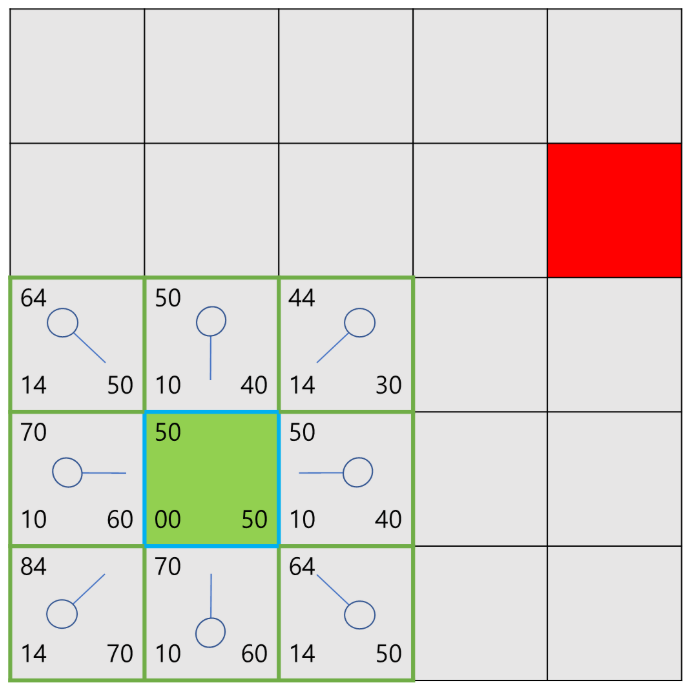
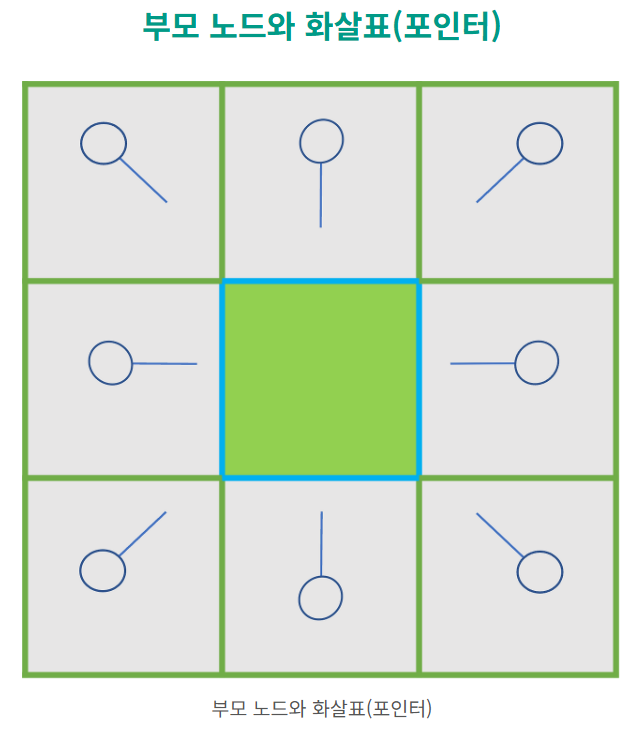
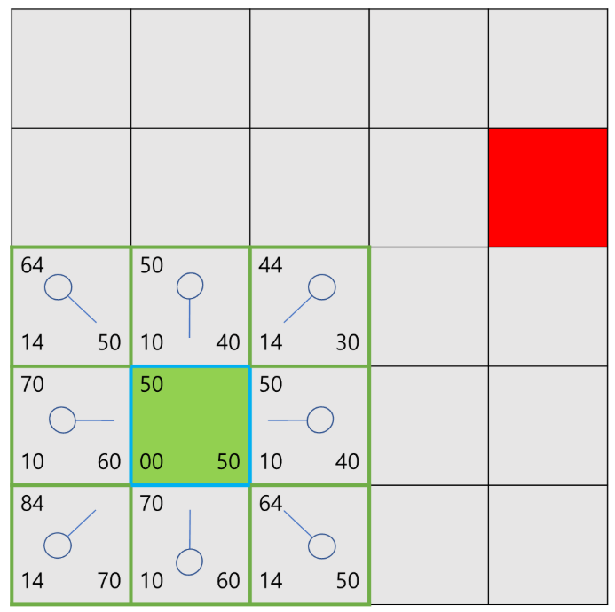
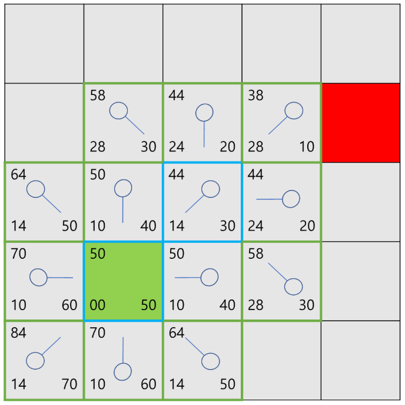
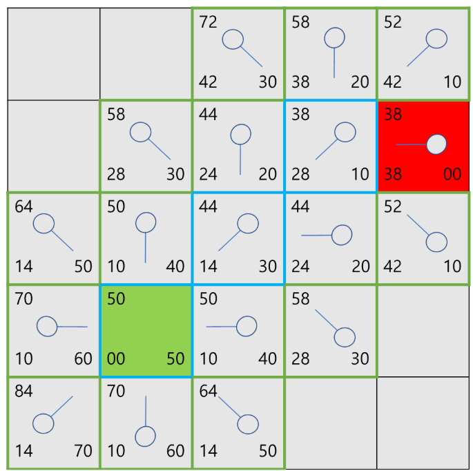
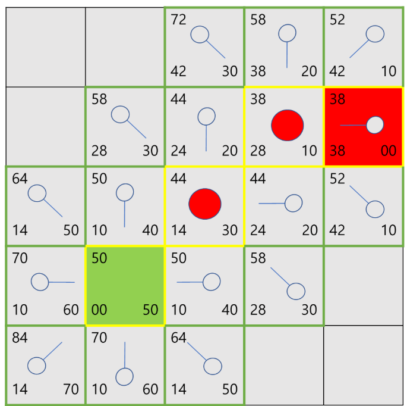

# A*와 Nav2 Global Planner

[학습 노트 목록으로 돌아가기](README.md)

## 1. A*가 필요한 이유

지도에서 시작점과 목적지가 주어졌을 때 장애물을 피하는 경로를 찾아야 한다.
모든 가능한 경로를 무작정 확인하면 느리므로, A*는 지금까지 든 비용과 목표까지
남았을 것으로 추정되는 비용을 함께 사용해 탐색 순서를 정한다.

Global Planner의 출력은 속도가 아니라 `nav_msgs/msg/Path`다.

```text
입력: Start pose + Goal pose + Global Costmap
탐색: Cost가 낮을 것으로 예상되는 node를 반복 확장
출력: Start부터 Goal까지 이어지는 Pose 목록
```

## 2. 핵심 비용 함수

```text
f(n) = g(n) + h(n)
```

- `g(n)`: 시작점에서 현재 node까지 실제로 누적된 비용
- `h(n)`: 현재 node에서 goal까지 남은 비용의 추정값(heuristic)
- `f(n)`: 이 node를 거쳐 goal로 갈 때의 예상 총비용

Open list에서 일반적으로 가장 작은 `f`를 가진 node를 꺼내 주변을 확장한다.
이미 더 좋은 비용으로 방문한 node는 갱신하지 않거나, 더 싼 경로를 찾았을 때
부모와 비용을 갱신한다.

## 3. Manhattan heuristic



상하좌우 이동만 가능한 격자라면 다음 추정값을 사용할 수 있다.

```text
h(n) = |x_goal - x_n| + |y_goal - y_n|
```

그림 속 각 칸은 `g`, `h`, `f`를 비교하는 교육용 예제다. 현재 프로젝트의
SmacPlannerHybrid가 이 그림과 똑같은 Manhattan heuristic을 사용한다고 뜻하지
않는다. 실제 planner는 차량 방향, motion primitive, 장애물 비용 등을 포함한다.

## 4. Parent pointer와 경로 복원



각 node에는 “이 node에 가장 싸게 도달했을 때의 이전 node”를 저장한다. Goal에
도달하면 parent를 역순으로 따라간 뒤 순서를 뒤집어 최종 Path를 만든다.

```text
Goal → parent → parent → ... → Start
                    역순 변환
Start → ... → Goal
```

## 5. 탐색 진행 과정

### Stage 1: 시작점 주변 후보 생성



### Stage 2: 후보의 비용 비교



### Stage 3: 가장 유망한 node 주변 확장



### Stage 4: goal 도달 후 경로 복원



## 6. Dijkstra와 A*의 관계

Dijkstra는 남은 거리 추정값을 사용하지 않는 경우로 볼 수 있다.

```text
Dijkstra: f(n) = g(n), 즉 h(n) = 0
A*:       f(n) = g(n) + h(n)
```

적절한 heuristic을 쓰면 A*는 goal 방향을 더 우선적으로 탐색할 수 있다. 다만
heuristic이 실제 남은 비용을 과대평가하는지, 일관성이 있는지에 따라 최적 경로
보장 조건이 달라진다.

## 7. 현재 워크스페이스의 Planner

### 실기 기본: SmacPlannerHybrid

[`scout_amcl.yaml`](../../src/scout_nav2/scout_nav2/params/scout_amcl.yaml)의
실제 설정은 다음과 같다.

```yaml
planner_plugins: ["GridBased"]
GridBased:
  plugin: "nav2_smac_planner/SmacPlannerHybrid"
  motion_model_for_search: "REEDS_SHEPP"
```

SmacPlannerHybrid는 `(x, y)` 위치만 탐색하는 단순 2D grid A*가 아니라 방향
`theta`와 운동학적으로 가능한 motion primitive를 함께 다루는 Hybrid-A* 계열이다.
Reeds-Shepp 모델은 전진과 후진을 포함할 수 있다.

| 주요 파라미터 | 현재 값 | 의미 |
|---|---:|---|
| `tolerance` | `0.25 m` | 정확한 goal 도달이 불가능할 때 허용 범위 |
| `motion_model_for_search` | `REEDS_SHEPP` | 전진/후진 가능한 탐색 모델 |
| `angle_quantization_bins` | `64` | 방향을 나누는 bin 수 |
| `minimum_turning_radius` | `0.2 m` | 탐색 경로의 최소 회전 반경 |
| `reverse_penalty` | `1.2` | 후진 motion에 추가하는 비용 |
| `non_straight_penalty` | `1.2` | 비직선 motion에 추가하는 비용 |
| `cost_penalty` | `2.0` | 높은 Costmap 영역을 피하는 정도 |
| `max_planning_time` | `10.0 s` | 계획에 허용된 최대 시간 |
| `smooth_path` | `true` | 탐색 결과 후처리 smoothing |

Scout는 제자리 회전이 가능한 differential drive인데, planner에는 Reeds-Shepp
모델이 설정돼 있다. 이것은 YAML에서 확인된 **현재 선택**이며, 로봇 운동학에 가장
적합한 선택인지 여부는 실제 주행 결과를 보고 별도로 판단해야 한다.

### 창고 시뮬레이션: NavFn의 Dijkstra 모드

[`scout_warehouse_sim/config/nav2_params.yaml`](../../src/scout_warehouse_sim/config/nav2_params.yaml)은
다음 설정을 사용한다.

```yaml
plugin: "nav2_navfn_planner/NavfnPlanner"
use_astar: false
```

따라서 창고 시뮬레이션에서 실제 선택된 탐색은 A*가 아니라 Dijkstra 방식이다.
A* 이미지들은 알고리즘 개념 학습용이고, 현재 창고 시뮬레이션의 정확한 실행
설명으로 사용하면 안 된다. `use_astar: true`로 변경해야 NavFn의 A* 모드를
요청하게 된다.

## 8. 파라미터를 바꾸면 생길 수 있는 변화

- `angle_quantization_bins` 증가: 방향 표현은 세밀해지지만 탐색 공간과 계산량이
  커질 수 있다.
- `minimum_turning_radius` 증가: 완만한 곡선을 선호하지만 좁은 공간에서 경로를
  못 찾을 수 있다.
- `reverse_penalty` 증가: 후진을 덜 선택하지만 복잡한 공간의 탈출이 어려워질 수 있다.
- `cost_penalty` 증가: 높은 비용 영역을 더 피하는 경향이 생긴다.
- `tolerance` 증가: goal 근처의 대체 지점을 더 쉽게 허용하지만 정확도가 낮아진다.

## 9. 코드와 실행을 확인하는 방법

이 워크스페이스에는 Nav2 planner 구현 소스 자체가 vendoring되어 있지 않고
plugin 설정이 들어 있다. 런타임에서는 다음을 확인한다.

```bash
ros2 param get /planner_server planner_plugins
ros2 param dump /planner_server
ros2 topic echo /plan
```

기억할 한 줄:

> A* 계열 Planner는 목적지까지의 Global Path를 만들며 `/cmd_vel`을 직접 만들지 않는다.

다음: [DWB Controller](02_dwb_controller.md)
