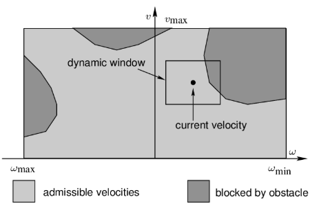
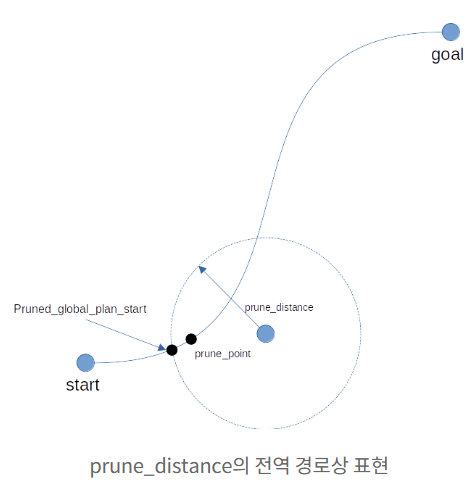
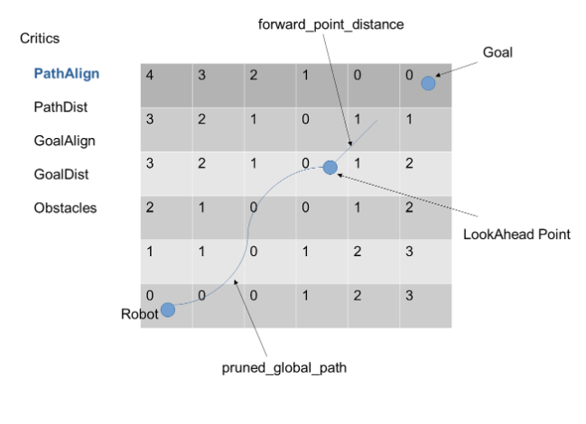
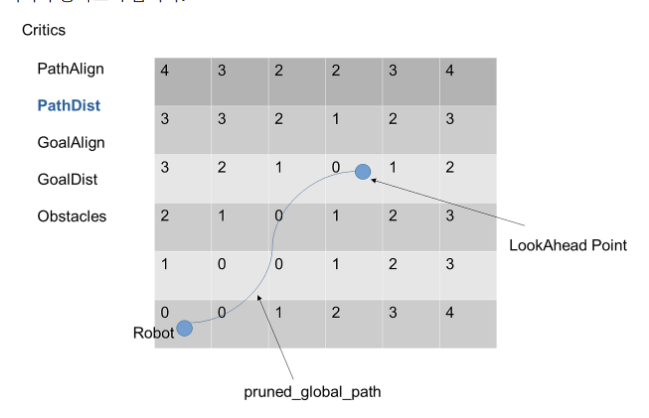
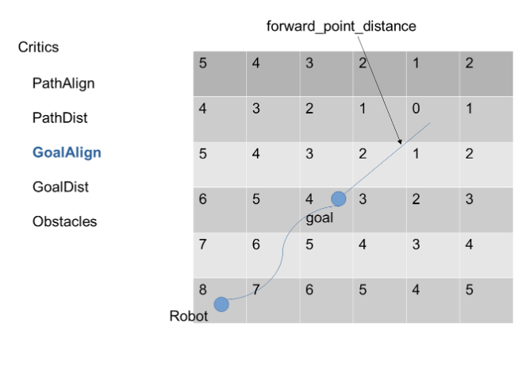
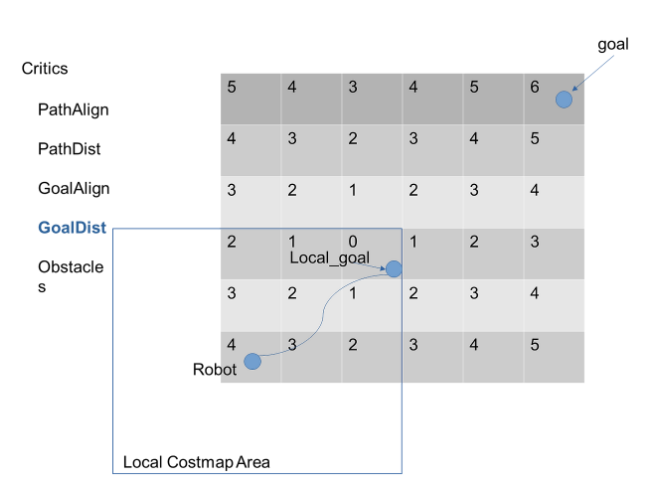

# DWB Controller

[학습 노트 목록으로 돌아가기](README.md)

> 현재 실기 기본 설정은 DWB가 아니라 MPPI다. 이 저장소에서 DWB는
> `scout_warehouse_sim`의 Nav2 설정에 실제로 사용된다.

## 1. DWB가 필요한 이유

Global Path만으로는 바로 앞에 새로 나타난 사람이나 상자를 실시간으로 피할 수
없다. DWB는 현재 속도와 가속도 제한 안에서 가능한 속도 후보를 만들고, 각 후보로
미래 trajectory를 시뮬레이션한 뒤 critic 점수가 가장 좋은 명령을 선택한다.

```text
입력
  현재 pose와 velocity
  Global Path
  Local Costmap
↓
(vx, vy, wz) 후보 생성
↓
각 후보의 미래 trajectory 시뮬레이션
↓
충돌 검사와 critic 평가
↓
가장 낮은 cost의 trajectory 선택
↓
첫 velocity를 Twist로 출력
```

## 2. Dynamic Window



그림의 세로축은 선속도 `v`, 가로축은 각속도 `ω`다. 전체 속도 공간 중 다음
조건을 만족하는 영역만 현재 control cycle의 후보가 된다.

1. 로봇의 최대·최소 속도 제한 안인가?
2. 현재 속도에서 가속도 제한 내에 도달 가능한가?
3. 장애물과 충돌하지 않는가?
4. 필요한 경우 안전하게 정지할 수 있는가?

DWB의 후보는 “경로상의 위치 점”이 아니라 “속도 명령과 그 명령으로 펼쳐진
local trajectory”다.

## 3. 현재 창고 시뮬레이션의 DWB 설정

설정 파일은
[`nav2_params.yaml`](../../src/scout_warehouse_sim/config/nav2_params.yaml)이다.

```yaml
controller_plugins: ["FollowPath"]
FollowPath:
  plugin: "dwb_core::DWBLocalPlanner"
```

등록된 Controller가 `FollowPath` 하나뿐이므로 DWB와 MPPI 사이를 자동 전환하는
구조가 아니다.

| 파라미터 | 현재 값 | 역할 | 값을 키웠을 때 |
|---|---:|---|---|
| `max_vel_x` | `0.26` | 최대 전진 속도 | 더 빠르지만 제동·회피 여유 감소 가능 |
| `max_vel_theta` | `1.0` | 최대 각속도 | 빠른 회전, 흔들림 가능성 증가 |
| `acc_lim_x` | `2.5` | 선가속 한계 | 목표 속도에 빨리 도달 |
| `acc_lim_theta` | `3.2` | 각가속 한계 | 회전 반응이 빨라짐 |
| `vx_samples` | `20` | x 속도 sample 수 | 후보가 촘촘해지고 계산량 증가 |
| `vtheta_samples` | `20` | 각속도 sample 수 | 회전 후보가 촘촘해지고 계산량 증가 |
| `sim_time` | `1.7 s` | 미래 simulation 시간 | 더 멀리 보지만 계산량·보수성 증가 가능 |
| `linear_granularity` | `0.05` | trajectory 선형 검사 간격 | 작으면 더 촘촘하지만 계산량 증가 |
| `angular_granularity` | `0.025` | 각도 검사 간격 | 작으면 회전 검사가 세밀해짐 |

Scout는 non-holonomic/differential drive이므로 `max_vel_y: 0.0`이다.
`vy_samples: 5`가 있어도 허용 y 속도 범위가 0이면 횡이동 명령을 만들 수 없다.

## 4. Global Path pruning



로봇이 이미 지나온 Global Path까지 계속 평가할 필요는 없다. Controller는 현재
로봇 위치를 기준으로 뒤쪽 path를 제거하고, Local Costmap 안의 관련 구간을 변환해
평가한다.

이 그림은 개념 학습용이다. 현재 창고 DWB YAML에는 별도의 `prune_distance`가
명시돼 있지 않으므로 plugin 기본값과 실제 설치 버전을 런타임에서 확인해야 한다.
MPPI 설정의 `prune_distance: 1.5`와 혼동하면 안 된다.

## 5. Critics

DWB는 하나의 점수만 보지 않고 여러 critic 점수를 scale과 함께 합산한다.
충돌 trajectory는 무효 처리될 수 있고, 유효 후보 중 총점이 가장 좋은 후보가
선택된다.

현재 활성 critic은 다음과 같다.

```yaml
critics:
  - RotateToGoal
  - Oscillation
  - BaseObstacle
  - GoalAlign
  - PathAlign
  - PathDist
  - GoalDist
```

### PathAlign



trajectory 끝 pose를 `forward_point_distance`만큼 앞쪽으로 이동시킨 점과 path
distance grid의 관계를 평가한다. 결과적으로 Global Path 진행 방향에 정렬되도록
유도하지만, yaw 차이를 직접 재는 단순 각도 critic으로 이해하면 정확하지 않다.
현재 `scale: 32.0`, `forward_point_distance: 0.1`이다.

### PathDist



trajectory가 Global Path에서 얼마나 떨어지는지를 평가한다. 현재 `scale: 32.0`이다.
값을 너무 높이면 장애물을 돌아가기보다 원래 path에 붙으려는 성향이 과해질 수 있다.

### GoalAlign



trajectory 끝 pose에서 앞쪽으로 이동시킨 점과 goal distance grid의 관계를
평가해 goal 방향 정렬을 유도한다. 현재 `scale: 24.0`,
`forward_point_distance: 0.1`이다.

### GoalDist



trajectory 끝이 goal 방향으로 얼마나 전진했는지를 평가한다. 현재 `scale: 24.0`이다.

### 나머지 critic

- `BaseObstacle`: robot footprint와 Costmap 장애물을 이용해 충돌 위험을 평가한다.
- `Oscillation`: 앞뒤 또는 좌우 명령이 반복적으로 바뀌는 현상을 억제한다.
- `RotateToGoal`: goal 근처에서 위치와 최종 yaw를 맞추도록 회전을 평가한다.

## 6. 점수 계산을 읽는 방법

개념적으로는 다음과 같이 이해할 수 있다.

```text
total_cost = Σ (critic_scale × critic_raw_score)
```

단, 실제로는 critic이 trajectory를 invalid로 만들거나, 설정에 따라 평가를 조기
종료할 수 있다. 현재 `short_circuit_trajectory_evaluation: true`이므로 이미 나쁜
후보라고 판단되면 뒤 critic 계산을 생략할 수 있다.

## 7. 장애물이 나타났을 때 DWB

```text
/points
→ Local Costmap VoxelLayer
→ 장애물 cell 생성 및 inflation
→ DWB가 velocity 후보마다 trajectory rollout
→ 충돌 후보 제거, 나머지 critic 채점
→ 최선의 (v, ω)
→ /cmd_vel
```

창고 시뮬레이션에서는 Local Costmap이 `/points`를 직접 받고, Global Costmap은
`/scan`을 받는다. 실기 구성과 topic 이름 및 계층이 다르다는 점에 주의한다.

## 8. 튜닝 순서

1. footprint와 Costmap 장애물 표시가 실제 로봇 크기와 맞는지 확인한다.
2. 최대 속도와 가속도를 안전한 범위로 정한다.
3. `sim_time`, sample 수로 후보 품질과 CPU 부하를 맞춘다.
4. `BaseObstacle`을 포함한 충돌 안전성을 먼저 확인한다.
5. 그다음 Path/Goal critic scale로 path 추종 성향을 조절한다.

Critic scale부터 바꾸면 센서, TF, footprint 문제를 튜닝으로 가릴 수 있다.

기억할 한 줄:

> DWB는 현재 가능한 속도를 sample하고, 각 속도의 trajectory를 평가해 가장 좋은 하나를 선택한다.

다음: [MPPI Controller](03_mppi_controller.md)
