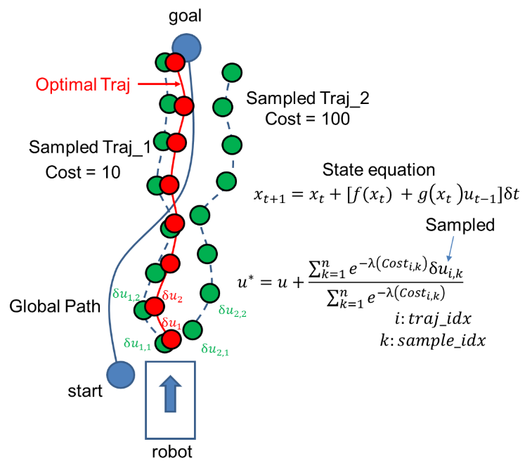
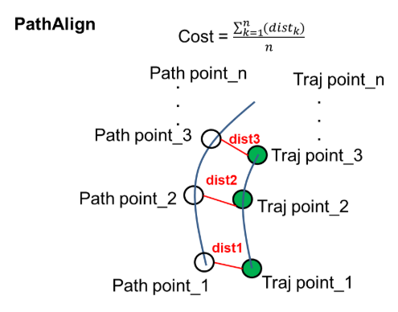
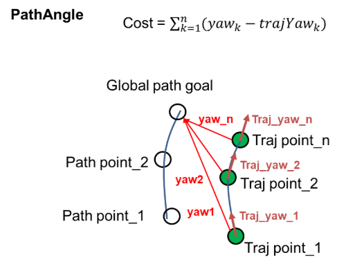
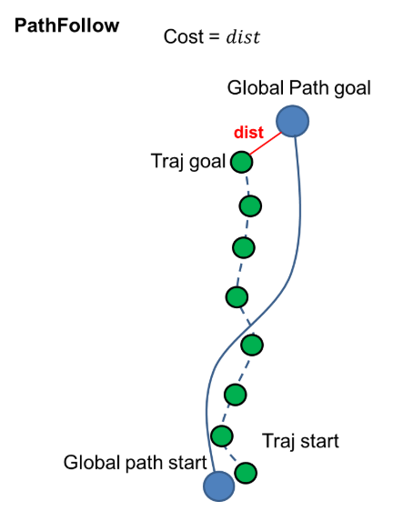

# MPPI Controller

[학습 노트 목록으로 돌아가기](README.md)

> MPPI는 현재 실기 기본 navigation의 실제 Controller다. `controller_plugins`에는
> `FollowPath` 하나만 등록돼 있으며 그 plugin이 MPPI이므로 DWB와 자동 전환하지 않는다.

## 1. MPPI가 필요한 이유

MPPI(Model Predictive Path Integral)는 현재 한 쌍의 속도만 독립적으로 비교하기보다
미래 여러 step의 control sequence를 만들고, noise를 넣어 많은 sequence를
sampling한 뒤 미래 상태와 비용을 계산한다.

```text
현재 nominal control sequence
↓
Gaussian noise를 더해 많은 sample 생성
↓
Motion model로 미래 trajectory rollout
↓
Critics가 sample별 cost 계산
↓
Cost가 낮은 sample에 더 큰 weight 부여
↓
가중 결과로 control sequence 갱신
↓
첫 control만 실행하고 다음 cycle에서 다시 계산
```

## 2. Sampling과 weighted update



- 파란 선: Global Path
- 점선과 점: noise가 추가된 sampled trajectory
- 각 trajectory의 `Cost`: critic들을 적용한 총비용
- 빨간 점: 좋은 sample들의 영향을 반영해 갱신된 control/trajectory의 개념

그림의 “Optimal Traj”를 단순히 sample 중 1등 하나라고 이해하면 안 된다. MPPI의
핵심은 낮은 cost sample의 perturbation에 큰 weight를 주어 nominal control sequence를
갱신하는 것이다.

개념식은 다음처럼 볼 수 있다.

```text
w_k ∝ exp(-cost_k / temperature)
u_new = u_nominal + Σ(w_k × noise_k) / Σ(w_k)
```

실제 구현의 cost 및 control cost 항은 더 구체적이며 `temperature`, `gamma` 등의
영향을 받는다.

## 3. 현재 실기 MPPI 설정

설정 파일은
[`scout_amcl.yaml`](../../src/scout_nav2/scout_nav2/params/scout_amcl.yaml)이다.

```yaml
controller_plugins: ["FollowPath"]
FollowPath:
  plugin: "nav2_mppi_controller::MPPIController"
  motion_model: "DiffDrive"
```

### Sampling과 prediction

| 파라미터 | 현재 값 | 의미 | 변화의 일반적 영향 |
|---|---:|---|---|
| `time_steps` | `50` | sequence의 미래 step 수 | 증가 시 더 멀리 예측, 계산량 증가 |
| `model_dt` | `0.1 s` | 한 step의 시간 | 증가 시 같은 step으로 더 먼 미래를 봄 |
| `batch_size` | `1000` | cycle당 sample 수 | 증가 시 탐색 다양성·계산량 증가 |
| `iteration_count` | `1` | cycle당 최적화 반복 | 증가 시 갱신 반복·계산량 증가 |
| `temperature` | `0.3` | sample weight 분포 | 작으면 좋은 sample에 더 집중하는 경향 |
| `gamma` | `0.015` | control/noise 비용 관련 계수 | exploration과 control effort에 영향 |
| `vx_std` | `0.2` | x 속도 noise 표준편차 | 증가 시 선속도 탐색 폭 증가 |
| `wz_std` | `0.4` | 각속도 noise 표준편차 | 증가 시 회전 탐색 폭 증가 |

현재 prediction horizon은 다음과 같다.

```text
time_steps × model_dt = 50 × 0.1 = 5.0초
```

5초 동안 같은 명령을 유지한다는 뜻은 아니다. 5초 길이의 미래 control sequence를
예측하고, 그중 첫 control만 실행한 뒤 다음 controller cycle에 다시 최적화한다.

### 속도와 경로 처리

| 파라미터 | 현재 값 | 의미 |
|---|---:|---|
| `vx_max` | `0.5 m/s` | 최대 전진 속도 |
| `vx_min` | `-0.3 m/s` | 최대 후진 방향 속도 |
| `vy_max` | `0.0 m/s` | 횡이동 불가 |
| `wz_max` | `0.5 rad/s` | 최대 회전 속도 |
| `prune_distance` | `1.5 m` | 뒤쪽 Global Path 정리 범위와 관련 |
| `motion_model` | `DiffDrive` | Scout에 적용된 MPPI motion model |

YAML에는 `AckermannConstraints`도 남아 있지만 현재 `motion_model`이 `DiffDrive`이므로
Ackermann 모델의 활성 제약으로 해석하면 안 된다.

## 4. MPPI Critics

현재 활성 critic은 다음과 같다.

```text
ConstraintCritic
ObstaclesCritic
GoalCritic
GoalAngleCritic
PathAlignCritic
PathFollowCritic
PathAngleCritic
TwirlingCritic
```

`PreferForwardCritic`은 설정 블록은 있지만 critics 목록에서 주석 처리되어 있고
`enabled: false`이므로 활성 상태가 아니다.

### PathAlignCritic



sampled trajectory가 Global Path 주변에 얼마나 잘 정렬되는지 평가한다. 현재
`cost_weight: 20.0`, `use_path_orientations: true`다. 이 critic만으로 로봇을 앞으로
진행시키는 것이 아니라 path 정렬을 돕는다.

### PathAngleCritic



trajectory의 heading과 path 방향의 상대 각도를 평가한다. 현재 `cost_weight: 4.0`,
`mode: 2`, `max_angle_to_furthest: 0.7`이다. 큰 방향 오차가 누적된 굽은 구간에서
path 방향으로 돌아오도록 돕는다.

### PathFollowCritic



trajectory가 path 앞쪽으로 진전하는지를 평가한다. 단순히 path 가까이에 머무르는
것과 “path를 따라 앞으로 가는 것”은 다르다. 현재 `cost_weight: 4.0`,
`offset_from_furthest: 6`이다.

### 안전과 goal 관련 critic

- `ObstaclesCritic`: Costmap과 footprint를 이용해 장애물 근접·충돌 비용을 준다.
  현재 `consider_footprint: true`, `collision_cost: 10000.0`,
  `collision_margin_distance: 0.1`이다.
- `ConstraintCritic`: 속도 및 운동학적 제약을 벗어난 trajectory를 벌점 처리한다.
- `GoalCritic`: goal 위치로 접근하도록 한다.
- `GoalAngleCritic`: goal 근처에서 최종 방향을 맞춘다.
- `TwirlingCritic`: 불필요한 회전을 억제한다.

`threshold_to_consider: 0.7`이 있는 critic은 goal까지 거리 등의 조건에 따라 적용
구간이 달라질 수 있다. 모든 critic이 모든 상황에서 똑같이 작동한다고 보면 안 된다.

## 5. DWB와 MPPI의 정확한 차이

| 항목 | DWB | MPPI |
|---|---|---|
| 기본 sample | 현재 가능한 velocity | 미래 control sequence + noise |
| 미래 상태 | 각 velocity로 rollout | motion model로 batch rollout |
| 선택 방식 | 가장 좋은 trajectory/command 선택 | sample cost를 weight로 control 갱신 |
| 주요 계산량 | sample 수와 simulation 길이 | batch × time steps × iterations |
| 현재 프로젝트 | 창고 시뮬레이션 | 실기 기본 navigation |

둘 다 Global Path와 Local Costmap을 입력으로 받고 `/cmd_vel` 계열 명령을 만드는
Controller plugin이다. 일반적인 실행 구조는 다음과 같다.

```text
                 ┌─ DWB  ─→ Twist
Global Path ─────┤
                 └─ MPPI ─→ Twist
```

현재 설정에는 Controller Selector로 둘을 바꾸는 구성이 없다.

## 6. 장애물이 나타났을 때 MPPI

1. `/velodyne_points`가 Local Costmap `VoxelLayer`에 장애물을 표시한다.
2. MPPI가 1,000개의 control sequence를 50 step씩 예측한다.
3. `ObstaclesCritic`이 장애물에 가까운 sample의 cost를 높이거나 충돌로 처리한다.
4. Path/Goal/Constraint critic 비용도 함께 계산한다.
5. 낮은 cost sample의 noise가 더 크게 반영되어 control sequence가 갱신된다.
6. 첫 명령이 `/cmd_vel_nav`로 나간다.
7. Velocity Smoother와 Collision Monitor를 거쳐 최종 `/cmd_vel`이 된다.

## 7. 튜닝할 때 확인할 순서

1. TF와 odometry가 흔들리지 않는지 확인한다.
2. footprint와 `/velodyne_points`의 obstacle marking이 맞는지 확인한다.
3. `vx_max`, `wz_max`, accel/decel을 Scout가 안전하게 수행 가능한 값에 맞춘다.
4. CPU가 controller frequency를 유지하는지 확인한 뒤 `batch_size`, `time_steps`를
   조절한다.
5. 장애물 안전성을 확인하고 Path/Goal critic weight를 조절한다.

`visualize: true`는 trajectory 확인에 유용하지만 계산 성능을 떨어뜨릴 수 있어 현재
설정은 `false`다.

## 8. 실행하면서 확인할 명령

```bash
ros2 param get /controller_server controller_plugins
ros2 param dump /controller_server
ros2 topic hz /cmd_vel_nav
ros2 topic echo /cmd_vel_nav
ros2 topic echo /local_costmap/costmap
```

기억할 한 줄:

> MPPI는 미래 control sequence를 많이 sampling하고, 좋은 sample들의 정보를 가중 결합해 다음 control을 갱신한다.

처음으로: [전체 흐름](00_nav2_overview.md)
