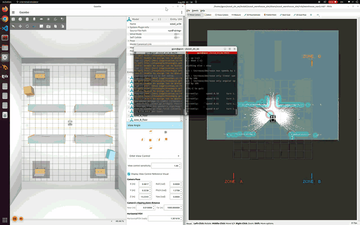
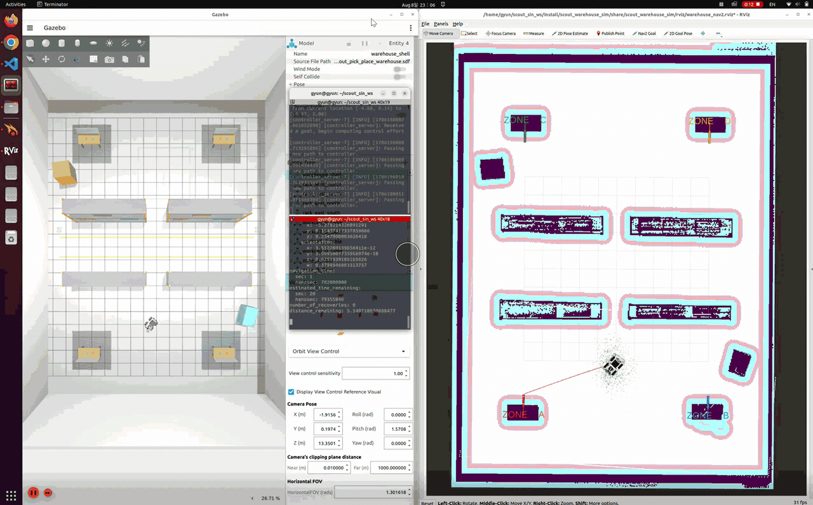

# Scout 창고 시뮬레이션 사용 설명서

이 문서는 `/home/gyun/scout_sin_ws`에 구성된 `scout_warehouse_sim`을 실행하고
조작하기 위한 명령어 중심 설명서다. Scout 주행, Velodyne 기반 SLAM, 맵 저장,
Nav2 자율주행, UR3e 동작, 손목 카메라 확인 방법을 모두 포함한다.

## 시뮬레이션 데모

### SLAM Mapping

<p align="center">
  
</p>

### Nav2 자율주행

<p align="center">
  
</p>

## 1. 현재 시뮬레이션 구성

- ROS 2 Humble
- Gazebo Fortress (`ign gazebo`)
- AgileX Scout 2.0 차동구동 베이스
- 실제 UR 공식 UR3e CAD 형상과 6개 회전 관절
- Robotiq 2F-85 실제 CAD 외형, 현재 손가락은 열린 자세로 고정
- UR3e 손목에 부착된 RealSense D435i RGB 카메라
- Scout 전방에 부착된 VLP-16 형태 3D LiDAR
- IMU와 ground-truth odometry
- 23 x 17 m 창고, 중앙 랙과 A/B/C/D 작업 구역
- A/B/C/D 작업대 상판 높이: 0.57 m

작업 구역 접근 pose는 다음과 같다.

| 구역 | 작업대 `(x, y, z)` | 접근 pose `(x, y, yaw)` |
|---|---|---|
| A | `(-8.0, 5.0, 0.57)` | `(-6.85, 5.0, 3.14159)` |
| B | `(-8.0, -5.0, 0.57)` | `(-6.85, -5.0, 3.14159)` |
| C | `(8.0, 5.0, 0.57)` | `(6.85, 5.0, 0.0)` |
| D | `(8.0, -5.0, 0.57)` | `(6.85, -5.0, 0.0)` |

## 2. 실행 모드 선택

동시에 여러 모드를 실행하지 않는다. 아래 세 가지 중 목적에 맞는 하나만 실행한다.

### 2.1 Gazebo와 센서만 실행

주행, 센서, 로봇팔만 시험할 때 사용한다. SLAM과 Nav2는 실행되지 않는다.

```bash
ros2 launch scout_warehouse_sim simulation.launch.py
```

Gazebo GUI 없이 실행:

```bash
ros2 launch scout_warehouse_sim simulation.launch.py gui:=false rviz:=false
```

RViz만 끄고 Gazebo는 표시:

```bash
ros2 launch scout_warehouse_sim simulation.launch.py rviz:=false
```

로봇 시작 위치를 변경할 수도 있다.

```bash
ros2 launch scout_warehouse_sim simulation.launch.py \
  x:=1.0 y:=2.0 yaw:=1.5708
```

`z` 기본값 `0.2346`은 Scout 모델의 정상 스폰 높이이므로 특별한 이유가 없으면
변경하지 않는다.

### 2.2 새 맵을 만드는 SLAM 모드

Gazebo, RViz, SLAM Toolbox, Nav2가 함께 실행된다.

```bash
ros2 launch scout_warehouse_sim slam.launch.py
```

GUI 없이 실행:

```bash
ros2 launch scout_warehouse_sim slam.launch.py gui:=false rviz:=false
```

맵 작성 순서:

1. 로봇 주변 장애물이 `/scan`과 RViz에 나오는지 확인한다.
2. 키보드로 천천히 중앙 통로를 한 바퀴 돈다.
3. A, B, C, D 구역을 차례로 방문한다.
4. 이미 지나간 위치로 돌아와 loop closure가 발생하도록 한다.
5. 벽과 랙이 겹치거나 이중으로 보이지 않는지 확인한다.
6. 충분히 탐색한 다음 맵을 저장한다.

### 2.3 저장한 맵으로 Nav2 localization 및 자율주행

먼저 SLAM 모드를 완전히 종료해야 한다. 저장한 YAML의 절대 경로를 지정한다.

```bash
ros2 launch scout_warehouse_sim navigation.launch.py \
  map:=/home/gyun/scout_sin_ws/src/scout_warehouse_sim/maps/warehouse.yaml
```

GUI 없이 실행:

```bash
ros2 launch scout_warehouse_sim navigation.launch.py \
  map:=/home/gyun/scout_sin_ws/src/scout_warehouse_sim/maps/warehouse.yaml \
  gui:=false rviz:=false
```

Nav2 localization 모드에서는 RViz의 `2D Pose Estimate`로 실제 Gazebo 로봇 위치와
방향을 먼저 지정한다. 초기 자세가 틀리면 경로 계획과 장애물 위치가 어긋난다.

## 3. 키보드로 Scout 운전하기

키보드 노드는 명령을 입력한 터미널이 포커스를 가지고 있어야 한다. 한글 입력
상태가 아니라 영문 키보드 상태에서 사용한다.

### 3.1 simulation.launch.py만 실행한 경우

```bash
ros2 run teleop_twist_keyboard teleop_twist_keyboard
```

이 경우 키보드 명령이 `/cmd_vel`로 바로 전달된다.

### 3.2 slam.launch.py 또는 navigation.launch.py 실행 중인 경우

Nav2의 velocity smoother 입력으로 보내는 다음 명령을 권장한다.

```bash
ros2 run teleop_twist_keyboard teleop_twist_keyboard \
  --ros-args -r cmd_vel:=cmd_vel_nav
```

Nav2 동작 중 `/cmd_vel`에 직접 발행하면 velocity smoother가 발행하는 값과 경쟁해
움직임이 끊기거나 명령이 무시된 것처럼 보일 수 있다.

### 3.3 방향키 배치

```text
u    i    o
j    k    l
m    ,    .
```

- `i`: 전진
- `,`: 후진
- `j`: 제자리 좌회전
- `l`: 제자리 우회전
- `u`: 전진하면서 좌회전
- `o`: 전진하면서 우회전
- `m`: 후진하면서 좌회전
- `.`: 후진하면서 우회전
- `k`: 정지
- 그 외 키: 정지
- `Ctrl-C`: 키보드 노드 종료

Scout는 차동구동 로봇이다. 안내문에 나오는 Shift 조합의 holonomic 좌우 평행이동은
지원하지 않으며 사용해도 옆으로 움직이지 않는다.

속도 조절:

- `q`: 선속도와 각속도 최대값 10% 증가
- `z`: 선속도와 각속도 최대값 10% 감소
- `w`: 선속도만 10% 증가
- `x`: 선속도만 10% 감소
- `e`: 각속도만 10% 증가
- `c`: 각속도만 10% 감소

SLAM에서는 급가속하거나 너무 빠르게 회전하지 않는다. 처음에는 선속도 약
`0.2~0.3 m/s` 수준으로 운전하는 것이 안정적이다. Nav2 velocity smoother의 현재
최대 선속도는 `0.26 m/s`, 최대 각속도는 `1.0 rad/s`다.

## 4. SLAM 맵 확인 및 저장

맵 토픽 확인:

```bash
ros2 topic hz /map
ros2 topic echo /map --once --field info
```

TF 확인:

```bash
ros2 run tf2_ros tf2_echo map odom
ros2 run tf2_ros tf2_echo odom base_footprint
```

맵 저장:

```bash
ros2 run nav2_map_server map_saver_cli \
  -f /home/gyun/scout_sin_ws/src/scout_warehouse_sim/maps/warehouse
```

정상 저장되면 다음 두 파일이 생성된다.

```text
warehouse.yaml
warehouse.pgm
```

파일 확인:

```bash
ls -lh /home/gyun/scout_sin_ws/src/scout_warehouse_sim/maps/
```

같은 이름으로 다시 저장하면 기존 맵 파일을 덮어쓸 수 있으므로 보존할 맵은
`warehouse_v1`, `warehouse_v2`처럼 다른 이름을 사용한다.

## 5. Nav2로 목적지 보내기

### 5.1 RViz에서 보내기

1. 저장 맵 localization 모드라면 `2D Pose Estimate`를 먼저 지정한다.
2. RViz 상단의 `Nav2 Goal`을 누른다.
3. 맵에서 목적지를 클릭하고 드래그해 최종 방향을 지정한다.
4. Global Path와 Local Path가 나타나는지 확인한다.

목표를 취소하려면 RViz의 Navigation 패널에서 취소하거나 다음 명령을 사용할 수 있다.

```bash
ros2 action list
ros2 action info /navigate_to_pose
```

### 5.2 명령줄에서 A/B/C/D 접근 지점 보내기

A 구역, 로봇 방향 180도:

```bash
ros2 action send_goal /navigate_to_pose nav2_msgs/action/NavigateToPose \
"{pose: {header: {frame_id: map}, pose: {position: {x: -6.85, y: 5.0, z: 0.0}, orientation: {x: 0.0, y: 0.0, z: 1.0, w: 0.0}}}}" \
--feedback
```

B 구역, 로봇 방향 180도:

```bash
ros2 action send_goal /navigate_to_pose nav2_msgs/action/NavigateToPose \
"{pose: {header: {frame_id: map}, pose: {position: {x: -6.85, y: -5.0, z: 0.0}, orientation: {x: 0.0, y: 0.0, z: 1.0, w: 0.0}}}}" \
--feedback
```

C 구역, 로봇 방향 0도:

```bash
ros2 action send_goal /navigate_to_pose nav2_msgs/action/NavigateToPose \
"{pose: {header: {frame_id: map}, pose: {position: {x: 6.85, y: 5.0, z: 0.0}, orientation: {x: 0.0, y: 0.0, z: 0.0, w: 1.0}}}}" \
--feedback
```

D 구역, 로봇 방향 0도:

```bash
ros2 action send_goal /navigate_to_pose nav2_msgs/action/NavigateToPose \
"{pose: {header: {frame_id: map}, pose: {position: {x: 6.85, y: -5.0, z: 0.0}, orientation: {x: 0.0, y: 0.0, z: 0.0, w: 1.0}}}}" \
--feedback
```

Nav2가 주행 중일 때 키보드 명령을 동시에 보내지 않는다. 수동 개입이 필요하면 먼저
현재 Nav2 goal을 취소한 뒤 teleop을 사용한다.

## 6. UR3e 로봇팔 움직이기

Gazebo 시뮬레이션이 실행 중이어야 한다. 제공된 안전 자세 두 개를 사용하면 가장 쉽다.

점검 자세로 이동:

```bash
ros2 run scout_warehouse_sim arm_pose_demo.py inspect
```

접힌 기본 자세로 복귀:

```bash
ros2 run scout_warehouse_sim arm_pose_demo.py home
```

이동 시간을 5초로 지정:

```bash
ros2 run scout_warehouse_sim arm_pose_demo.py inspect --duration 5.0
```

UR3e 관절 이름과 기본 자세는 다음 순서다.

```text
ur3e_shoulder_pan_joint    0.0
ur3e_shoulder_lift_joint  -1.5708
ur3e_elbow_joint           1.5708
ur3e_wrist_1_joint        -1.5708
ur3e_wrist_2_joint        -1.5708
ur3e_wrist_3_joint         0.0
```

관절 상태 확인:

```bash
ros2 topic echo /joint_states --once
```

직접 JointTrajectory 명령을 보내는 예제:

```bash
ros2 topic pub --once /arm_joint_trajectory \
trajectory_msgs/msg/JointTrajectory \
"{joint_names: [ur3e_shoulder_pan_joint, ur3e_shoulder_lift_joint, ur3e_elbow_joint, ur3e_wrist_1_joint, ur3e_wrist_2_joint, ur3e_wrist_3_joint], points: [{positions: [0.35, -1.35, 1.35, -1.35, -1.35, 0.25], time_from_start: {sec: 3, nanosec: 0}}]}"
```

주의 사항:

- 처음에는 제공된 `home`, `inspect` 자세만 사용한다.
- 관절값 단위는 radian이다.
- 이동 중 Scout를 급격히 주행시키지 않는다.
- 작업대나 Scout 본체와 충돌할 수 있는 큰 관절 명령을 바로 보내지 않는다.
- 현재 Robotiq 손가락은 열린 자세의 강체이므로 개폐 명령은 지원하지 않는다.
- 실제 pick-and-place에는 MoveIt 2, 그리퍼 컨트롤러와 물체 attach/detach 기능이
  추가로 필요하다.

## 7. Velodyne, LaserScan, IMU 확인

3D 포인트 클라우드 주기 확인:

```bash
ros2 topic hz /points
```

메시지 한 번 확인:

```bash
ros2 topic echo /points --once --field header
```

SLAM용 2D LaserScan 확인:

```bash
ros2 topic hz /scan
ros2 topic echo /scan --once --field header
```

IMU 확인:

```bash
ros2 topic hz /imu/data
ros2 topic echo /imu/data --once
```

Odometry 확인:

```bash
ros2 topic hz /odometry
ros2 topic echo /odometry --once --field pose.pose
```

Velodyne는 Gazebo에서 16채널 3D `/points`를 생성한다. 패키지 내부 변환 노드가
바닥을 제외한 수평 영역을 선택해 `/scan`을 만들며, SLAM Toolbox와 global
costmap이 이 `/scan`을 사용한다. Nav2 local costmap은 `/points`를 직접 사용한다.

## 8. 손목 RealSense 카메라 확인

RGB 영상 주기:

```bash
ros2 topic hz /wrist_camera/image_raw
```

영상 프레임 확인:

```bash
ros2 topic echo /wrist_camera/image_raw --once --field header
```

카메라 보정 정보 확인:

```bash
ros2 topic echo /wrist_camera/camera_info --once
```

`rqt_image_view`가 설치되어 있다면 영상 창으로 확인할 수 있다.

```bash
ros2 run rqt_image_view rqt_image_view /wrist_camera/image_raw
```

RViz에서는 `Add` -> `By topic` -> `/wrist_camera/image_raw` -> `Image`를 선택한다.
카메라는 UR3e 손목에 고정되어 있으므로 로봇팔이 움직이면 영상 시점도 함께 움직인다.

## 9. 주요 ROS 토픽과 역할

| 토픽 | 타입/역할 |
|---|---|
| `/cmd_vel` | Scout에 최종 전달되는 주행 속도 |
| `/cmd_vel_nav` | SLAM/Nav2 모드의 velocity smoother 입력 |
| `/odometry` | Scout odometry |
| `/tf`, `/tf_static` | 로봇과 맵 좌표계 변환 |
| `/points` | Velodyne 3D PointCloud2 |
| `/scan` | SLAM용 2D LaserScan |
| `/imu/data` | Scout IMU |
| `/joint_states` | 바퀴와 UR3e 관절 상태 |
| `/arm_joint_trajectory` | UR3e 6축 자세 명령 |
| `/wrist_camera/image_raw` | 손목 RGB 영상 |
| `/wrist_camera/camera_info` | 손목 카메라 내부 파라미터 |
| `/map` | SLAM 또는 map server가 발행하는 OccupancyGrid |
| `/workcell_markers` | A/B/C/D 이름과 접근 방향 RViz marker |

전체 토픽 목록:

```bash
ros2 topic list | sort
```

노드 목록:

```bash
ros2 node list | sort
```

특정 토픽 연결 상태:

```bash
ros2 topic info /cmd_vel -v
ros2 topic info /points -v
ros2 topic info /arm_joint_trajectory -v
```

## 10. 좌표계 구조

주요 TF 구조는 다음과 같다.

```text
map -> odom -> base_footprint -> base_link/mobile_robot_base_link
                                      |-> velodyne_link
                                      |-> UR3e links
                                           |-> wrist camera frames
```

- SLAM 또는 AMCL: `map -> odom`
- Gazebo odometry: `odom -> base_footprint`
- robot_state_publisher: Scout, UR3e, LiDAR, 카메라 내부 링크 TF

TF 트리 생성:

```bash
ros2 run tf2_tools view_frames
```

현재 위치 확인:

```bash
ros2 run tf2_ros tf2_echo map base_footprint
```

## 11. 자주 발생하는 문제

### Gazebo에서 Scout가 움직이지 않는다

1. Gazebo 왼쪽 아래 또는 상단의 재생 버튼이 Pause 상태인지 확인한다.
2. teleop 터미널을 클릭하고 영문 입력 상태인지 확인한다.
3. `k`를 한 번 누른 뒤 `i`를 눌러본다.
4. 실행 모드에 맞는 토픽을 사용한다.

simulation 모드:

```bash
ros2 run teleop_twist_keyboard teleop_twist_keyboard
```

SLAM/Nav2 모드:

```bash
ros2 run teleop_twist_keyboard teleop_twist_keyboard \
  --ros-args -r cmd_vel:=cmd_vel_nav
```

명령이 실제로 나오는지 확인:

```bash
ros2 topic echo /cmd_vel
```

### 키 조작이 너무 빠르거나 어렵다

teleop 실행 직후 `z` 또는 `x`를 여러 번 눌러 선속도를 낮춘다. SLAM에서는 급회전보다
`u`, `i`, `o`를 이용해 넓게 회전하는 것이 맵 품질에 유리하다. 즉시 멈추려면 `k`다.

### `/map`이 나오지 않는다

```bash
ros2 node list | grep slam
ros2 topic hz /scan
ros2 run tf2_ros tf2_echo odom base_footprint
```

`/scan` 또는 odometry TF가 없으면 SLAM이 맵을 만들 수 없다. 로봇이 전혀 움직이지
않았을 때도 유효한 맵 영역이 매우 작을 수 있다.

### Nav2 Goal을 줘도 움직이지 않는다

```bash
ros2 lifecycle nodes
ros2 action info /navigate_to_pose
ros2 topic hz /map
ros2 run tf2_ros tf2_echo map base_link
```

저장 맵 navigation 모드에서는 RViz의 `2D Pose Estimate`를 먼저 지정해야 한다.
목표가 장애물 또는 벽 안에 있지 않은지도 확인한다.

### 카메라나 LiDAR 데이터가 없다

```bash
ros2 topic hz /wrist_camera/image_raw
ros2 topic hz /points
ros2 topic hz /scan
ros2 node list | grep scout_gz_bridge
```

Gazebo가 Pause 상태면 `/clock`과 센서 데이터도 멈춘다.

### 로봇팔이 움직이지 않는다

```bash
ros2 topic info /arm_joint_trajectory -v
ros2 topic hz /joint_states
ros2 run scout_warehouse_sim arm_pose_demo.py inspect --duration 5.0
```

시뮬레이션이 먼저 실행되어 있어야 하며 `/arm_joint_trajectory`에 Gazebo bridge
subscriber가 존재해야 한다.

## 12. 정상 실행 빠른 점검 명령

시뮬레이션 실행 후 아래 명령들이 응답하면 기본 연결은 정상이다.

```bash
ros2 topic hz /clock
ros2 topic hz /odometry
ros2 topic hz /points
ros2 topic hz /scan
ros2 topic hz /wrist_camera/image_raw
ros2 topic echo /joint_states --once
```

SLAM 모드 추가 점검:

```bash
ros2 topic hz /map
ros2 run tf2_ros tf2_echo map odom
```

Nav2 추가 점검:

```bash
ros2 action info /navigate_to_pose
ros2 lifecycle nodes
```

## 13. 권장 전체 작업 순서

### 처음 맵 만들기

터미널 1:

```bash
ros2 launch scout_warehouse_sim slam.launch.py
```

터미널 2:

```bash
ros2 run teleop_twist_keyboard teleop_twist_keyboard \
  --ros-args -r cmd_vel:=cmd_vel_nav
```

터미널 3, 탐색 완료 후:

```bash
ros2 run nav2_map_server map_saver_cli \
  -f /home/gyun/scout_sin_ws/src/scout_warehouse_sim/maps/warehouse
```

### 저장 맵으로 Nav2 실행

터미널 1:

```bash
ros2 launch scout_warehouse_sim navigation.launch.py \
  map:=/home/gyun/scout_sin_ws/src/scout_warehouse_sim/maps/warehouse.yaml
```

RViz에서 `2D Pose Estimate`를 지정한 뒤 `Nav2 Goal`을 보낸다.

### 로봇팔과 카메라 시험

터미널 2:

```bash
ros2 run scout_warehouse_sim arm_pose_demo.py inspect
ros2 topic hz /wrist_camera/image_raw
ros2 run scout_warehouse_sim arm_pose_demo.py home
```

## 14. 종료 방법

- launch가 실행 중인 터미널: `Ctrl-C`
- teleop 터미널: `Ctrl-C`
- `rqt_image_view`: 창을 닫거나 터미널에서 `Ctrl-C`
- 종료 후 새 모드를 실행하기 전에 기존 Gazebo와 launch가 완전히 종료됐는지 확인한다.

정상적인 종료는 항상 launch 터미널에서 `Ctrl-C`를 사용하는 것이 가장 안전하다.

## 15. 주요 파일 위치

```text
/home/gyun/scout_sin_ws/src/scout_warehouse_sim/
├── launch/
│   ├── simulation.launch.py
│   ├── slam.launch.py
│   └── navigation.launch.py
├── config/
│   ├── nav2_params.yaml
│   ├── slam_toolbox.yaml
│   ├── ros_gz_bridge.yaml
│   └── workcells.yaml
├── worlds/scout_pick_place_warehouse.sdf
├── urdf/scout_ur3e_velodyne.urdf.xacro
├── scripts/arm_pose_demo.py
├── maps/
└── rviz/warehouse_nav2.rviz
```

`unita_minicar_sim_ws`는 이 시뮬레이션의 실행 의존성이 아니므로 나중에 삭제해도
`scout_warehouse_sim` 실행에는 영향을 주지 않는다.
